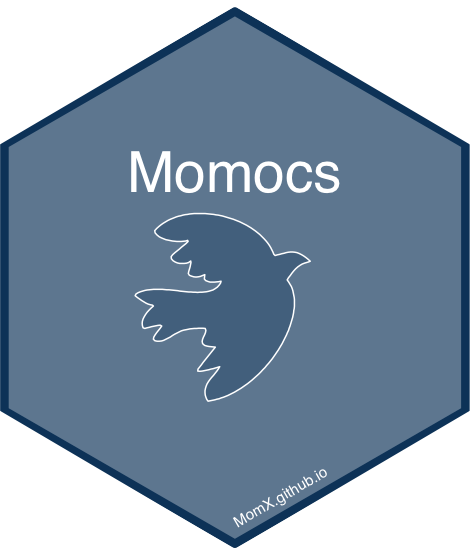

<!-- README.md is generated from README.Rmd. Please edit that file -->

# Momocs2 <a href="https://momx.github.io/Momocs2/"></a>

<!-- badges: start -->

[](https://CRAN.R-project.org/package=Momocs2)
[](https://github.com/MomX/Momocs2/actions/workflows/R-CMD-check.yaml)
[](https://lifecycle.r-lib.org/articles/stages.html#experimental)
<!-- badges: end -->

The goal of Momocs2 is to provide…

## Installation

You can install the development version of Momocs2 like so:

``` r
# later
```

## Example

This is a basic example which shows you how to solve a common problem.
