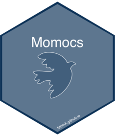

# Momocs 2.0 

<!-- badges: start -->
#### Github version

#### CRAN version

 
<!-- badges: end -->

<!--
The goal of Momocs is to provide a complete, convenient, reproducible and open-source toolkit for 2D morphometrics.

It includes most common 2D morphometrics approaches on outlines, open outlines, configurations of landmarks, traditional morphometrics, and facilities for data preparation, manipulation and visualization with a consistent grammar throughout.

It allows reproducible, pipeable, complex morphometric analyses and other morphometrics approaches should be easy to plug in, or develop from, on top of this canvas.

It hinges on the core functions developed in the must-have book _[Morphometrics with R](http://www.springer.com/statistics/life+sciences,+medicine+%26+health/book/978-0-387-77789-4)_ by [Julien Claude](http://www.isem.univ-montp2.fr/recherche/equipes/biologie-du-developpement-et-evolution/personnel/claude-julien/) (2008).

* __Check__ the online doc and the tutorials [there](http://momx.github.io/Momocs/)
* __You're welcome to__ implement ideas, propose new ones, review the code, the helpfiles or the vignettes, report bugs, ask for help and propose to collaborate with me: [here on GitHub](https://github.com/MomX/Momocs/issues) or there: `bonhomme.vincent@gmail.com`.

-->

### News 
* Momocs is being actively rewritten around tibbles. I plan a 2.0 release in April 2020.
* Bits of dismembered old Momocs will feed MomX ecosystem.

* The last version (1.2.9) released on CRAN is [available there as a .tar.gz](https://cran.r-project.org/src/contrib/Archive/Momocs/Momocs_1.2.9.tar.gz)
* The last version (1.3.0) released on GitHub is [available here as a .tar.gz](https://github.com/MomX/Momocs/releases/download/1.3.0/Momocs_1.3.0.tar.gz)
* None of them are no longer supported.
* I will soon release Momocs 2.0

### Here and now
This repository is for developping Momocs 2.0

Along the course of years, Momocs development has known several phases so did my ability to do basic and cool stuff in R. Now it's time for a big cleanup of this tentacular package that became really painful to maintain.

I plan a release to CRAN in June 2020 or before. If you don't like it, I'll keep the last version (1.3.0) available but it will not be maintained in any way.

All suggestions, help, etc. are welcome, ring my bell: `bonhomme.vincent@gmail.com`.

## Big changes going on

* Overall, embrace [tidy manifesto](https://tidyverse.tidyverse.org/articles/manifesto.html)
* Momocs is now restricted to manipulating shapes and describing them into coefficients. Import function will be entirely rewritten and part of `Momit`. Statistical tools will be part of `Momstats`. This will allow a much easier maintenance. Also development on top of Momocs will be a piece of cake. More packages are on their way and I'll verse them progressively into MomX.
* All objects are now [tibbles](https://tibble.tidyverse.org/), and Momocs is thus tidyverse ready. `dplyr`, `purrr` and `ggplot2` and other tidyverse packages are your new friends. You're worth it and you will rock it.
* Former S3 classes `Coo` and `Coe` spirit is still around but they are turned into columns, as lists of shapes and lists of coordinates. Overall Momocs is more open-minded about what is a shape.
* All graphs have been rewritten, a curated list of interesting datasets.
* Help pages have been rewritten and examples are now more interesting.
* Vignettes and companion websites.
* Test coverage is now decent.
* Overall, the code is more concise, consistent, commented. And yet this is the most dramatic change, it is mostly internal. For instance, this still works like a charm: `bot %T>% panel %>% efourier %T>% boxplot %>% PCA %>% plot`.

## Smaller changes (work in progress)

### working with shapes
* `coo_` ended up doing very different things: modifying shapes (eg `coo_center`), describing shapes (eg `coo_centpos`), testing shapes (eg `coo_likely_clockwise`) and even plotting (eg `coo_plot`). This was very confusing. 
  * `coo_` is now reserved for shape modifyers (eg `coo_center`)
  * `get_` is now for shape descriptors (thos that return a scale, eg `get_perim`; or a longer description eg `get_perimpts`)
  
### graphics
  * all graphics are delegated to `ggplot2`.
  * all objects have now two defaut methods: `gg` a default visualization with sensible choices, `gg0` is the empty canvas that just waits for `geoms`
  * other plotting functions have more sensible names (eg `plot_ruban`)
  * I still think `grindr` has merits but it's deprecated.
  

